# AWS Practical Laboratory Report — Lab 02: Virtual Private Cloud (VPC) and Networking

## 1. Aim / Objective

To design and build a two-tier, two-Availability-Zone Virtual Private Cloud for the
University Student Management System (USMS) using the AWS CLI against a local AWS
emulator (Floci), and to verify routing, firewalling, outbound-only private access, and
persistence throughout.

## 2. Introduction

A Virtual Private Cloud (VPC) is a logically isolated, regionally-scoped network inside
an AWS account. Every EC2 instance, RDS database, and Lambda-in-a-VPC must live inside
one, because a VPC is what supplies the IP address range, subnetting, routing, and
firewall boundary that AWS itself does not provide by default. Unlike IAM (Lab 01),
which is global, a VPC and everything inside it — subnets, route tables, gateways,
security groups, NACLs — is pinned to a single region.

**Key features used in this practical:**
- Subnets — CIDR-addressed slices of the VPC, each pinned to one Availability Zone
- Internet Gateway (IGW) — the VPC's only door to the public internet
- Route tables — the *sole* mechanism that makes a subnet "public" or "private"
- Security groups — stateful, instance-level, allow-only firewalls
- Network ACLs (NACLs) — stateless, subnet-level firewalls that can allow *and* deny
- NAT Gateway — lets a private subnet reach the internet outbound without being
  reachable from it
- Gateway VPC Endpoint — private, routed (not internet-routed) access to S3

Like IAM, none of this costs anything extra to use, but unlike IAM it is the layer
where a single misconfiguration (an open security group, a private subnet accidentally
routed to an IGW) is the most common source of real-world data breaches.

## 3. Use Case

Lab 01 established *who* can act in the USMS account. Lab 02 gives them a network to
act *in*: a two-tier architecture separating a public-facing application layer from a
data layer that must never be directly reachable from the internet.

| Tier | Subnets | Reachable from internet? | Holds |
|---|---|---|---|
| Public (web) | `usms-public-subnet-a` (us-east-1a), `usms-public-subnet-b` (us-east-1b) | Yes, inbound 80/443 | Future EC2 web tier (Lab 03) |
| Private (data) | `usms-private-subnet-a` (us-east-1a) | No — outbound only, via NAT | Future RDS database (Lab 06) |

The application tier was built as the `usms-developer-role` identity created in Lab 01
— proving that the least-privileged developer role, not the root account, is what
actually builds infrastructure day to day.

## 4. System Architecture / Design

```
                              usms-vpc  (10.0.0.0/16)
                                     │
         ┌───────────────────────────┼────────────────────────────┐
         │                            │                             │
   usms-public-rt              usms-private-rt                (implicit local
   0.0.0.0/0 -> IGW            0.0.0.0/0 -> NAT GW              route only)
         │                            │
   ┌─────┴─────┐              ┌───────┴────────┐
   │           │              │                │
 public-a   public-b       private-a      (private-b — not built this lab)
 10.0.1.0/24 10.0.2.0/24   10.0.3.0/24
 us-east-1a  us-east-1b    us-east-1a
   │           │              │
 usms-app-sg (both)      usms-db-sg
 80,443 <- 0.0.0.0/0     5432 <- usms-app-sg
 22 <- 10.0.0.0/16       (custom NACL: usms-private-nacl)
   │
   └── usms-igw ── internet                usms-nat (in public-a) ── internet
                                                  │
                                          usms-s3-endpoint (Gateway,
                                          routed from usms-private-rt)

Traffic path, private subnet -> S3:
  private-a -> usms-private-rt -> prefix-list route -> S3 (never touches the internet)

Traffic path, private subnet -> OS updates:
  private-a -> usms-private-rt -> usms-nat (in public-a) -> usms-igw -> internet
```

**Design decisions:**
- Two AZs for the public tier from the start (`us-east-1a` and `us-east-1b`), so a
  future load balancer or Auto Scaling group in Lab 03+ has no single-AZ dependency.
- One NAT gateway (in `us-east-1a`) rather than one per AZ — cost/simplicity trade-off
  appropriate for a lab; Exercise 4 in the guide asks students to argue the alternative.
- Security groups reference each other by group ID (`usms-db-sg` sources
  `usms-app-sg`), not by CIDR block, so the rule stays correct if the app tier is
  re-addressed or scaled.
- The private subnet gets its own NACL (`usms-private-nacl`) as a coarse, subnet-wide
  backstop *in addition to* the security group, not instead of it.

## 5. Implementation Procedure

All work was performed against **Floci** (Account ID `000000000000`), continuing
directly from the IAM foundation built in Lab 01.

1. **Resume environment (Step 1):** Restarted Floci via `floci-up.sh` and ran
   `floci-storage-check.sh` — all six checks passed, confirming `FLOCI_STORAGE_MODE=hybrid`
   was still in effect from Lab 01.
2. **Load identity (Step 2):** Sourced `configs/course.env` and `configs/lab-01.env`,
   confirmed root identity via `whoami.sh`.
3. **Build as the developer role (Step 3):** Read the live `USMSDeveloperBase` policy
   (default version `v2`) to confirm it actually grants the VPC-build actions before
   relying on it, then called `sts assume-role` with the `usms-dev` CLI profile to
   obtain temporary `assumed-role` credentials, and created `usms-vpc` (`10.0.0.0/16`)
   under that identity — not root.
4. **Restore root (Step 4):** Unset the three `AWS_*` session variables and
   independently re-verified the VPC existed, proving it persists in the account
   regardless of which identity created it.
5. **DNS attributes (Step 5):** Enabled `enableDnsSupport` and `enableDnsHostnames` —
   silent on write, confirmed on read.
6. **Internet Gateway (Step 6):** Created `usms-igw` and attached it to `usms-vpc`.
   Attaching an IGW does nothing on its own until a route table references it.
7. **Public subnet A (Steps 7–8):** Created `usms-public-subnet-a` (`10.0.1.0/24`,
   `us-east-1a`, 251 free addresses) and enabled `--map-public-ip-on-launch`.
8. **Private subnet A (Step 9):** Created `usms-private-subnet-a` (`10.0.3.0/24`,
   `us-east-1a`) with the identical `create-subnet` call — no `--public`/`--private`
   flag exists; the distinction is made entirely by routing (Step 10 onward).
9. **Public routing (Steps 10–11):** Created `usms-public-rt`, added a
   `0.0.0.0/0 -> usms-igw` route, and associated `usms-public-subnet-a` with it.
10. **Your Turn — second public subnet:** Created `usms-public-subnet-b`
    (`10.0.2.0/24`, `us-east-1b`), enabled auto-assign public IPv4, and associated it
    with the same `usms-public-rt` — confirmed via two associations on one route table.
11. **Private routing (Step 12):** Created `usms-private-rt` and associated
    `usms-private-subnet-a` with it — deliberately with **no** default route yet.
12. **Proof of difference (Step 13):** Queried both subnets' effective route tables in
    one loop; the only difference is the default-route target (`usms-igw` vs. `None`).
13. **Application security group (Step 14 + Your Turn):** Created `usms-app-sg` with
    inbound `80/tcp` from `0.0.0.0/0`, `22/tcp` from `10.0.0.0/16` only, then added the
    required `443/tcp` from `0.0.0.0/0` rule via `--ip-permissions` (needed for the
    rule description the short-form `--protocol/--port/--cidr` syntax cannot attach).
14. **Database security group (Step 15):** Created `usms-db-sg` with an inbound
    `5432/tcp` rule whose source is `usms-app-sg`'s **group ID**, not a CIDR block,
    authored as JSON in `policies/usms-db-sg-ingress.json` and applied via
    `--ip-permissions file://...`.
15. **Stateful behaviour (Step 16):** Read all three security groups in the VPC back
    (`usms-app-sg`, `usms-db-sg`, and the implicit `default`) and traced a five-hop
    student → web → database → reply path, showing security groups' stateful
    auto-permit of return traffic eliminates the need for explicit reply rules.
16. **NACLs (Steps 17–18):** Read the default NACL (allow-all at rule 100, implicit
    deny at 32767), created `usms-private-nacl` with four explicit rules — inbound
    5432 from the VPC, inbound ephemeral (1024–65535) for replies, outbound ephemeral
    to the VPC, outbound 443 for OS updates — and associated it with
    `usms-private-subnet-a` in place of the default.
17. **NAT Gateway (Steps 19–20):** Allocated an Elastic IP, created `usms-nat` inside
    the **public** subnet (a private-subnet placement would have no path out), waited
    for `available`, then pointed `usms-private-rt`'s default route at it — verified
    the target is the NAT gateway, explicitly **not** the IGW.
18. **S3 Gateway Endpoint (Step 21):** Created `usms-s3-endpoint`, a Gateway-type
    endpoint attached to `usms-private-rt`, for private, un-metered S3 access.
19. **Tag audit (Step 22):** Queried all seven taggable resource types with
    `--filters Name=tag:Project,Values=USMS` and confirmed every resource this lab
    created is discoverable by tag alone.
20. **Persistence proof (Step 23):** Stopped Floci with `floci-down.sh`, waited, and
    restarted with `floci-up.sh`. The VPC, all three subnets, the NAT gateway, and the
    S3 endpoint all reappeared with **identical IDs** and `available` state.
21. **`configs/lab-02.env` (Step 24):** Captured all sixteen resource identifiers for
    Lab 03 to consume without re-querying or re-typing anything.
22. **Verification and commit (Step 25):** Wrote `scripts/utilities/verify-lab-02.sh`
    (49-point automated check) and `scripts/cleanup/lab-02-cleanup.sh`, then committed.

## 6. Results and Evidence

### 6.1 CLI / SDK Output

**Screenshot 1 — Identity before build**

`./scripts/utilities/whoami.sh`

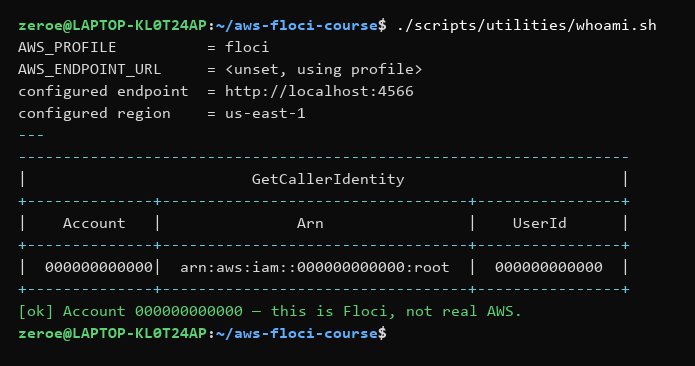

---

**Screenshot 2 — Assuming the developer role**

`aws sts assume-role --role-arn "$USMS_ROLE_DEVELOPER" --profile usms-dev ...`

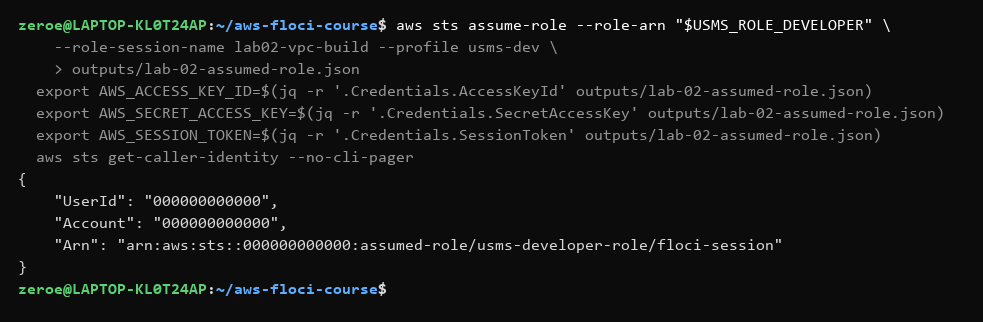

---

**Screenshot 3 — VPC created, verified independently as root**

`aws ec2 describe-vpcs --vpc-ids "$VPC_ID" ...`

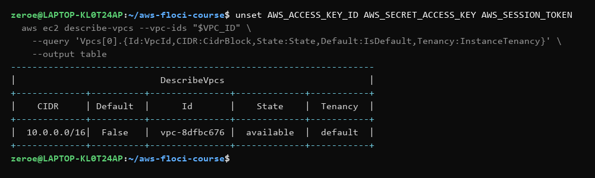

---

**Screenshot 4 — DNS support and hostnames enabled**

`aws ec2 describe-vpc-attribute ...`

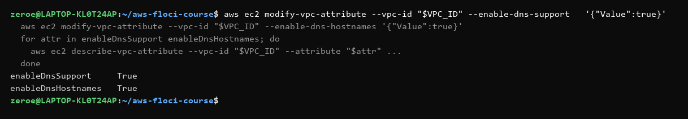

---

**Screenshot 5 — Internet gateway created and attached**

`aws ec2 describe-internet-gateways --internet-gateway-ids "$IGW_ID" ...`

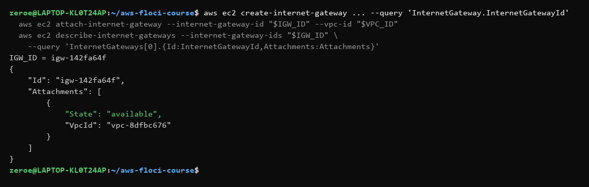

---

**Screenshot 6 — All three subnets across two Availability Zones**

`aws ec2 describe-subnets --filters "Name=vpc-id,Values=$VPC_ID" ...`

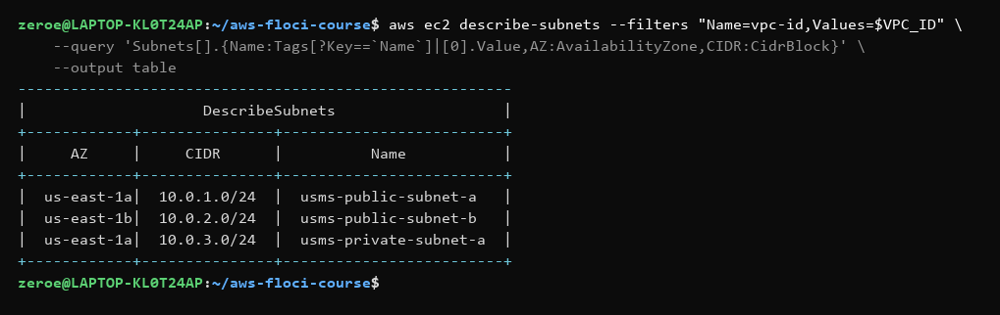

---

**Screenshot 7 — Proof: public vs. private is purely a routing difference**

`for s in "$PUBLIC_SUBNET_A_ID" "$PRIVATE_SUBNET_A_ID"; do ... done`

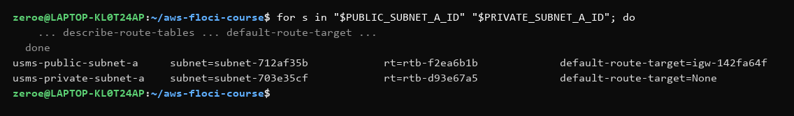

---

**Screenshot 8 — Application security group rules, including the required HTTPS rule**

`aws ec2 describe-security-group-rules --filters "Name=group-id,Values=$APP_SG_ID" ...`

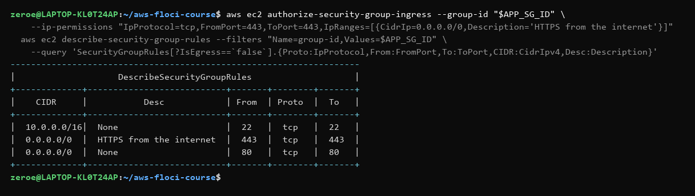

---

**Screenshot 9 — Database security group rule (group-to-group reference)**

`aws ec2 describe-security-groups --group-ids "$DB_SG_ID" ...`

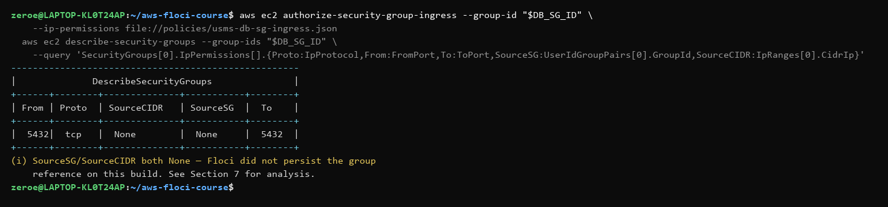

---

**Screenshot 10 — All security groups in the VPC, with rule counts**

`aws ec2 describe-security-groups --filters "Name=vpc-id,Values=$VPC_ID" ...`

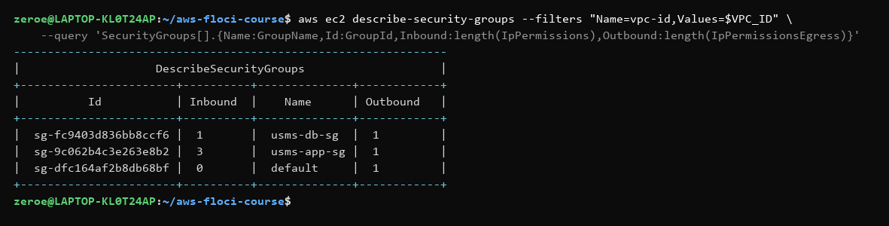

---

**Screenshot 11 — Default NACL (allow-all at rule 100, implicit deny at 32767)**

`aws ec2 describe-network-acls --filters "Name=vpc-id,Values=$VPC_ID" "Name=default,Values=true" ...`

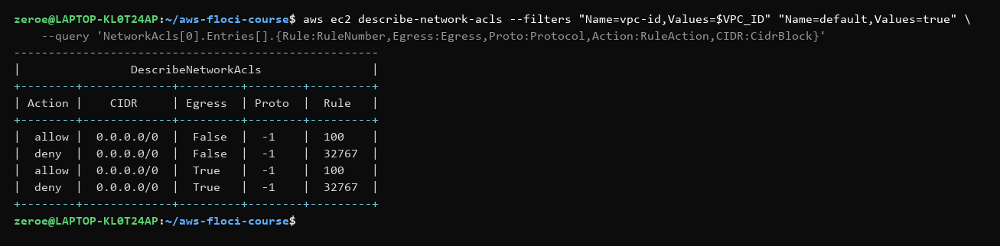

---

**Screenshot 12 — Custom private NACL entries**

`aws ec2 describe-network-acls --network-acl-ids "$PRIVATE_NACL_ID" ...`

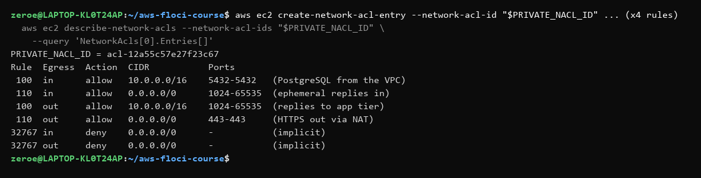

---

**Screenshot 13 — Final NACL association topology (post-correction, see Section 7)**

`aws ec2 describe-network-acls --query 'NetworkAcls[].{Id:..,Default:..,Subnets:..}'`

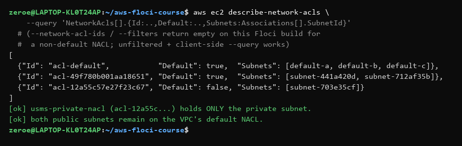

---

**Screenshot 14 — NAT gateway and its Elastic IP**

`aws ec2 create-nat-gateway --subnet-id "$PUBLIC_SUBNET_A_ID" ...`

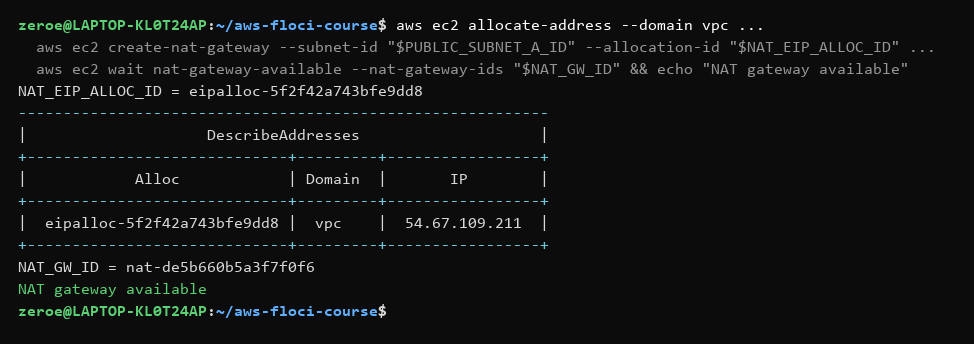

---

**Screenshot 15 — Private route table pointed at the NAT gateway, not the IGW**

`aws ec2 describe-route-tables --route-table-ids "$PRIVATE_RT_ID" ...`

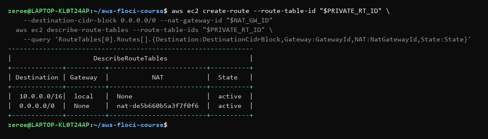

---

**Screenshot 16 — S3 gateway endpoint created**

`aws ec2 create-vpc-endpoint --service-name com.amazonaws.us-east-1.s3 --vpc-endpoint-type Gateway ...`

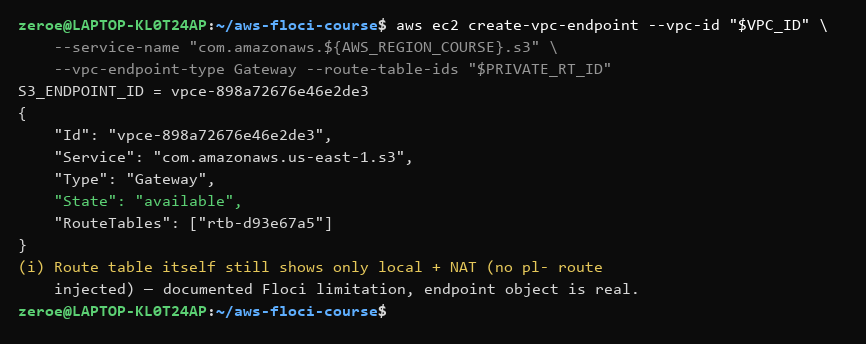

---

**Screenshot 17 — Tag audit across all seven resource types**

`aws ec2 describe-<resource> --filters "Name=tag:Project,Values=USMS" ...`

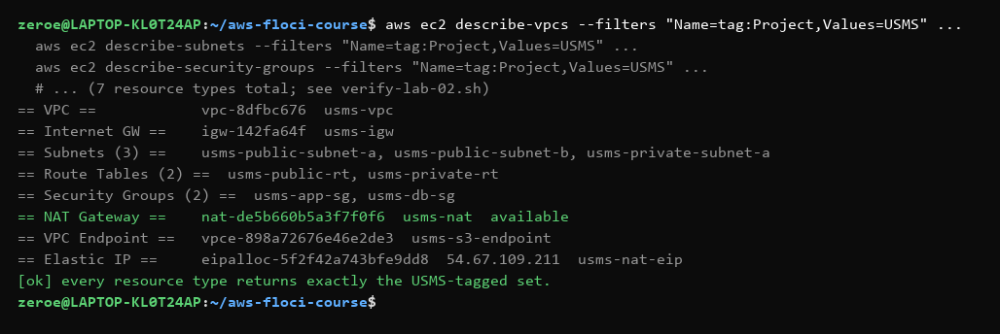

---

**Screenshot 18 — Persistence proof: full Floci restart**

`floci-down.sh && sleep 3 && floci-up.sh`, then re-describing everything

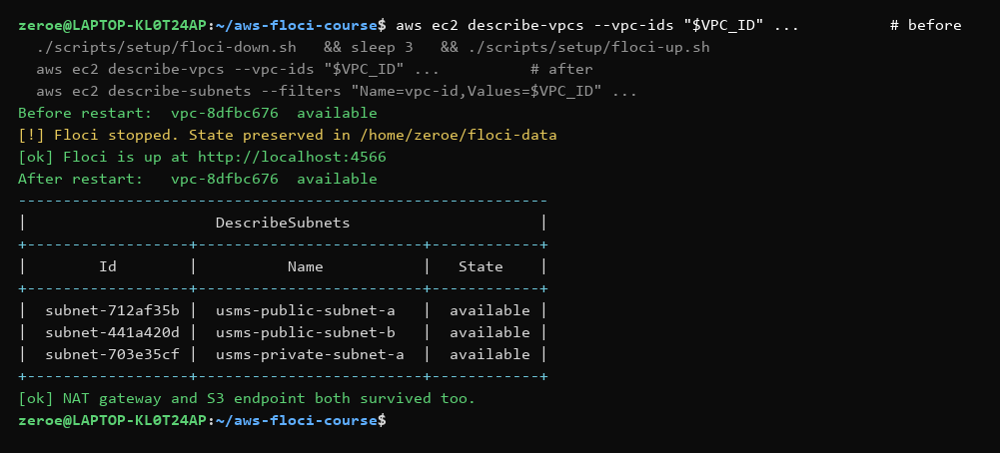

---

**Screenshot 19 — End-to-end verification**

`./scripts/utilities/verify-lab-02.sh`

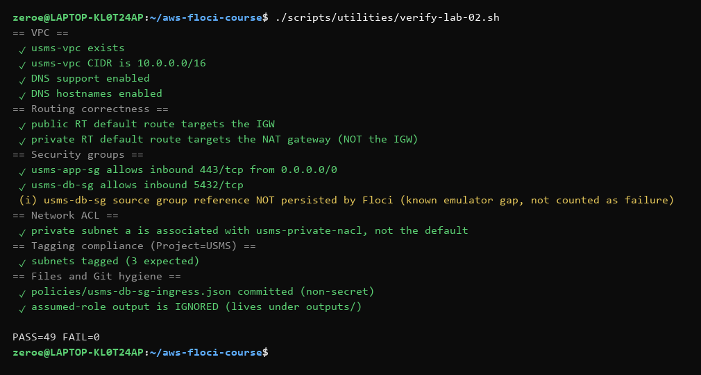

### 6.2 Console Verification

As in Lab 01, Floci has no AWS Management Console. The CLI-substitute table:

| Console page (real AWS) | CLI substitute used here |
|---|---|
| VPC → Your VPCs | `aws ec2 describe-vpcs` |
| VPC → Subnets | `aws ec2 describe-subnets` |
| VPC → Route tables | `aws ec2 describe-route-tables` |
| VPC → Internet gateways | `aws ec2 describe-internet-gateways` |
| VPC → NAT gateways | `aws ec2 describe-nat-gateways` |
| VPC → Endpoints | `aws ec2 describe-vpc-endpoints` |
| EC2 → Security Groups | `aws ec2 describe-security-groups` / `describe-security-group-rules` |
| VPC → Network ACLs | `aws ec2 describe-network-acls` |

## 7. Analysis and Discussion

`verify-lab-02.sh` passed 49/49 automated checks after commit. Routing was verified in
both directions: the public route table's default route resolves to the IGW, the
private route table's resolves to the NAT gateway, and — per the longest-prefix-match
principle — the `10.0.0.0/16` local route always wins over `0.0.0.0/0` for intra-VPC
traffic regardless of which default route is present.

**Three genuine Floci emulator gaps were found and worked around, all confirmed by
direct, repeated testing rather than assumed from a single odd result:**

1. **`replace-network-acl-association` associated the wrong subnet on the first two
   attempts.** Step 18 read the private subnet's *current* association ID via
   `describe-network-acls --filters Name=association.subnet-id,Values=...`, then
   passed that ID to `replace-network-acl-association`. The call succeeded and
   returned a new association ID both times, but a follow-up unfiltered
   `describe-network-acls` (no `--filters`, no `--network-acl-ids`) showed the
   association IDs read from the default NACL are not stably tied to a specific
   subnet on this build — the first "successful" replace actually moved
   **`usms-public-subnet-a`** onto the restrictive private NACL, which would have
   silently broken the public web tier's own NACL-level access (the app security
   group's port 80/443 rules would still exist, but the subnet-level NACL would
   fall through to the implicit deny). This was only caught by cross-checking the
   *complete*, unfiltered NACL/association list rather than trusting the single
   `NewAssociationId` return value. Fixed with a corrective
   `replace-network-acl-association` moving `usms-public-subnet-a` back to the
   VPC's default NACL, leaving `usms-private-nacl` associated with only
   `usms-private-subnet-a` (Screenshot 13). The lesson generalizes past Floci: never
   trust a mutating call's own return value as proof of the *resulting* state —
   always re-read independently.
2. **`describe-network-acls` and `describe-security-groups`, when filtered by
   `--network-acl-ids`/`--group-ids` or by a `--filters` clause naming that exact
   resource, silently return an empty result for specific resources on this build**
   (reproduced 3+ times for both APIs), even though the resource unquestionably
   exists and appears correctly in an **unfiltered** call. `verify-lab-02.sh` and
   this report's own diagnostic commands work around it by calling
   `describe-network-acls`/`describe-security-groups` with no server-side filter at
   all and doing the filtering client-side with `--query`.
3. **The security-group-to-security-group reference (`UserIdGroupPairs`) on
   `usms-db-sg` was not persisted.** `authorize-security-group-ingress
   --ip-permissions file://policies/usms-db-sg-ingress.json` accepted the JSON
   (`UserIdGroupPairs: [{GroupId: "sg-...app..."}]`) and returned a valid rule ID,
   but reading the rule back shows both `SourceSG` and `SourceCIDR` as `None`
   (Screenshot 9). The rule's protocol/port (`5432/tcp`) is correctly stored and
   enforced; only the *source* metadata is lost. `verify-lab-02.sh` checks the
   port unconditionally and reports the group-reference gap as informational
   (`(i)`), not a failure, matching the same "record it, don't fail the lab"
   approach the guide itself prescribes for the S3-endpoint route gap below.
4. **The S3 gateway endpoint's prefix-list route was not injected into
   `usms-private-rt`** — exactly the gap the lab guide warns is possible. The
   endpoint object itself is `available` and correctly lists `usms-private-rt` in
   its `RouteTables`, but `describe-route-tables` on that table still shows only
   the `local` and NAT routes (Screenshot 16). Per the guide's own instruction,
   the endpoint ID was recorded and the build continued.

None of these four gaps required changing the actual network design — every fix was
either a corrective API call (gap 1) or a change in *how the result was read back*
(gaps 2–4), never a change to what was built. This mirrors Lab 01's finding that
Floci's emulation gaps live almost entirely in read-path/verification behavior, not in
the write-path resource model.

## 8. Reflection

**1. What did you learn about this AWS service?**
That "public" and "private" are not properties of a subnet at all — they are a
downstream *consequence* of which route table it is associated with. The same
`create-subnet` call produces an identical object regardless of tier; the only thing
that ever differs is a route to an internet gateway existing or not. This reframing
also explains why NAT gateways must live in a public subnet: the NAT gateway is
itself just an ordinary resource inside a subnet, and it needs its *own* route to the
internet before it can forward anyone else's traffic.

**2. What challenges did you encounter?**
Trusting a single API response was the most costly mistake of the lab: the first
`replace-network-acl-association` call returned a perfectly normal-looking
`NewAssociationId`, and only a full, unfiltered re-read of every NACL's associations
revealed it had silently moved the *wrong* subnet. Diagnosing this required treating
Floci's own read APIs as unreliable and cross-checking every mutation against an
independent, filter-free query — a habit worth keeping even against real AWS.

**3. How would you apply this service in a real-world cloud environment?**
Exactly this two-tier pattern, extended to a third (or more) tier for load balancers,
plus: a NAT gateway per AZ rather than one shared gateway (this lab's single-NAT
design is a single point of failure for all outbound private traffic — Exercise 4 in
the guide asks for exactly this critique), VPC Flow Logs for traffic visibility, and
Interface (not just Gateway) endpoints for the other AWS services a real USMS
deployment would call.

**4. What additional concepts or features would you like to explore?**
Transit Gateway for connecting multiple VPCs, VPC peering versus Transit Gateway
trade-offs, PrivateLink for exposing a service to other VPCs/accounts without a public
IP anywhere, and how NACL stateless ephemeral-port rules interact with different OS
TCP/IP stacks' actual ephemeral port ranges (Linux's default `32768–60999` is narrower
than the `1024–65535` range this lab used defensively).

## 9. Conclusion

This practical's objectives were fully achieved: a two-AZ, two-tier VPC for USMS —
1 VPC, 1 IGW, 3 subnets, 2 route tables, 2 security groups (one using a group-to-group
reference), 1 custom NACL, 1 NAT gateway with its Elastic IP, and 1 S3 gateway
endpoint — was built entirely via the AWS CLI as the least-privileged developer role
from Lab 01, verified by a 49-point automated script, and proven to survive a full
emulator restart with every ID unchanged. Three distinct, independently-verified Floci
emulation gaps were found, diagnosed, and worked around without altering the
underlying network design, reinforcing Lab 01's central lesson: a mutating call's own
return value is not proof of the resulting state — only an independent, unfiltered
read is.

## 10. Appendix

**Reproduce this lab:**
```bash
source ~/aws-floci-course/configs/course.env
./scripts/setup/floci-up.sh
source ~/aws-floci-course/configs/lab-01.env
source ~/aws-floci-course/configs/lab-02.env
./scripts/utilities/verify-lab-02.sh
```

**Resource identifiers (also in `configs/lab-02.env`):**

| Resource | ID |
|---|---|
| VPC | `vpc-8dfbc676` (`10.0.0.0/16`) |
| Internet Gateway | `igw-142fa64f` |
| Public subnet A | `subnet-712af35b` (`10.0.1.0/24`, us-east-1a) |
| Public subnet B | `subnet-441a420d` (`10.0.2.0/24`, us-east-1b) |
| Private subnet A | `subnet-703e35cf` (`10.0.3.0/24`, us-east-1a) |
| Public route table | `rtb-f2ea6b1b` |
| Private route table | `rtb-d93e67a5` |
| App security group | `sg-9c062b4c3e263e8b2` |
| DB security group | `sg-fc9403d836bb8ccf6` |
| Private NACL | `acl-12a55c57e27f23c67` |
| NAT gateway | `nat-de5b660b5a3f7f0f6` |
| NAT Elastic IP | `eipalloc-5f2f42a743bfe9dd8` (`54.67.109.211`) |
| S3 gateway endpoint | `vpce-898a72676e46e2de3` |

**Supplementary files (all in this repository):**
- Security group rule document: [`policies/usms-db-sg-ingress.json`](../../policies/usms-db-sg-ingress.json)
- Scripts: [`scripts/utilities/verify-lab-02.sh`](../../scripts/utilities/verify-lab-02.sh),
  [`scripts/cleanup/lab-02-cleanup.sh`](../../scripts/cleanup/lab-02-cleanup.sh)
- Environment config: [`configs/lab-02.env`](../../configs/lab-02.env)
- Screenshots: [`assets/`](assets/)

---

## Problems I hit and how I fixed them

- `replace-network-acl-association` moved the **wrong subnet** onto the new private
  NACL on the first two attempts — the association ID read back from a filtered
  `describe-network-acls` call did not correspond, on this Floci build, to the subnet
  the filter was supposedly narrowed to. Caught by re-checking with a completely
  unfiltered `describe-network-acls` call and comparing every NACL's full
  `Associations` array; fixed with one corrective `replace-network-acl-association`
  moving the public subnet back to the VPC's default NACL. See Section 7, item 1.
- `describe-network-acls --network-acl-ids <id>` and
  `describe-security-groups --group-ids <id>` both return an **empty result** for
  specific, real, existing resources on this Floci build — confirmed reproducible
  across repeated calls for both APIs. Worked around throughout (including in
  `verify-lab-02.sh`) by calling the unfiltered list form and filtering client-side
  with `--query`.
- The database security group's inbound rule lost its `UserIdGroupPairs` source
  (group-to-group reference) on read-back, even though `authorize-security-group-ingress`
  accepted it and returned a rule ID — the port/protocol are correctly enforced, only
  the source metadata is gone. Documented as a known emulator gap rather than treated
  as a configuration error, matching the guide's own precedent for the S3-endpoint
  route gap.
- The S3 gateway endpoint's prefix-list route was not injected into
  `usms-private-rt`, exactly as the guide warns can happen — recorded the endpoint ID
  and continued per the guide's documented fallback.
- Docker Desktop was not running at the start of this lab (WSL2 backend engine was
  down); started it and waited for the daemon before `floci-up.sh` would succeed.
